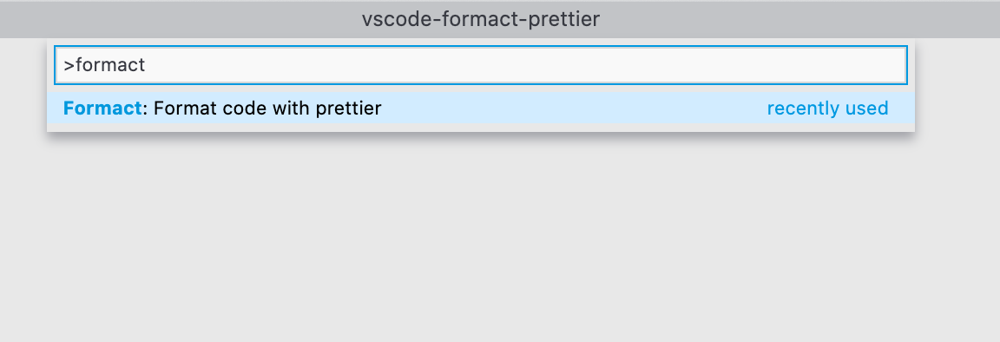
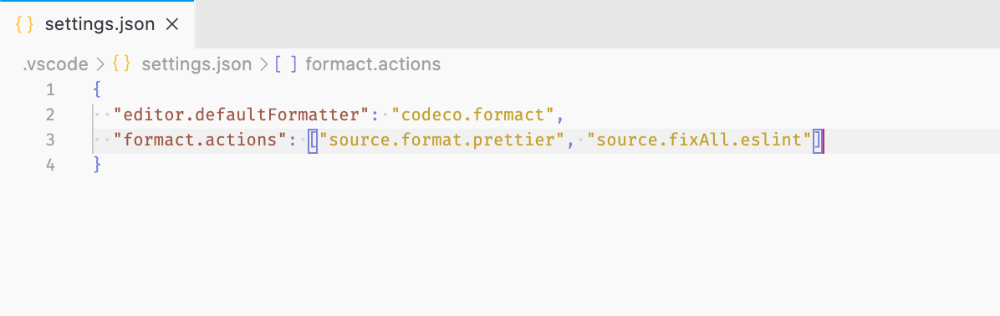
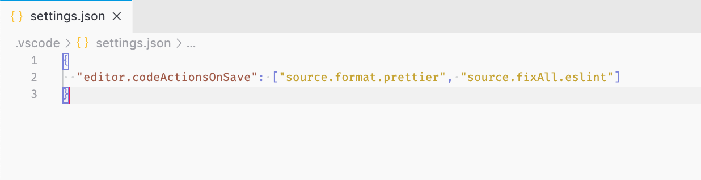

  
  <h1 align="center">Formact + Prettier</h1>
   

VSCode extension to enable run the Prettier action when formatting

## Installation

You can install this extension by one of the following options

- Search for `formact-prettier` on vscode marketplace
- Launch vscode quick open (Ctrl+p) and paste the following command

  `ext install codeco.formact-prettier`

## How to use it _?_

This extensions add an action that can be called in vscode command (Crtl+Shift+p)

Can be used with [formact extension](https://github.com/adrielcodeco/vscode-formact) passing `formact.prettier.format` action

Or can be used on `editor.codeActionsOnSave` passing `formact.prettier.format` action

